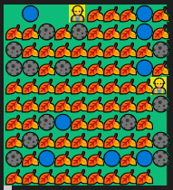
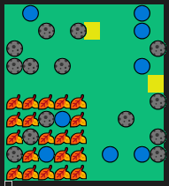

# Индивидуальное домашнее задание №4
## Евсюков Александр  <br/> Группа БПИ224  <br/> Вариант 12
## _Условие:_ 
Задача о нелюдимых садовниках. Имеется пустой участок земли (двумерный массив размером M ×N) и план сада, разбитого на
отдельные квадраты. От 10 до 30 процентов (задается случайно)
площади сада заняты прудами или камнями. То есть недоступны
для ухаживания. Эти квадраты располагаются на плане произвольным (случайным) образом. Ухаживание за садом выполняют два
садовника, которые не хотят встречаться друг другом (то есть, одновременно появляться в одном и том же квадрате). Первый садовник начинает работу с верхнего левого угла сада и перемещается
слева направо, сделав ряд, он спускается вниз и идет в обратном
направлении, пропуская обработанные участки. Второй садовник
начинает работу с нижнего правого угла сада и перемещается снизу
вверх, сделав ряд, он перемещается влево и также идет в обратную
сторону. Если садовник видит, что участок сада уже обработан другим садовником или является необрабатываемым, он идет дальше.
Если по пути какой-то участок занят другим садовником, то садовник ожидает когда участок освободится, чтобы пройти дальше на
доступный ему необработанный участок. Садовники должны работать одновременно со скоростями, определяемыми как параметры задачи. Прохождение через любой квадрат занимает некоторое время, которое задается константой, меньшей чем времена
обработки и принимается за единицу времени. Создать многопоточное приложение, моделирующее работу садовников. Каждый садовник — это отдельный поток.

## _Решение:_
_Модель параллельных вычислений:_

Имеется 3 потока, первый и второй потоки моделируют работу садовников, третий является основным, управляющим, в нем происходит создание объектов сада и садовников, ввод параметров программы, запуск первого и второго потомков, вывод сада на экран или в файл (при необходимости) при возникновении изменений в саде, завершение работы первых и вторых потоков. Для синхронизации действий потоков используется mutex, запрещающий двум потокам одновременно изменять состояние квадрата поля сада (с "необработанный" на "находится под обработкой") и одновременно считывать состояние квадрата, который может быть необработанным. Таким образом достигается поставленная в условии задачи требование о том, что если один садовник обрабатывает квадрат, то второй садовник ждет, пока первый закончит обработку прежде, чем пройти на этот квадрат.

_3 режима работы программы_:
* запуск через командную строку с флагом -f для чтения данных из файла и запись в файл. Пример:
    ```
    ./Computer-Architecture-IHW4 -f input.txt output.txt
    ```
    `Примечание: `
    1. Для запуска необходимо перейти в папку с собранной программой по адресу `build/solution`. Например у меня это выглядит так: `alex@DESKTOP-R68N48Q:~/Computer-Architecture-IHW4/build/solution$`. 
    2. Файлы, которые мы собираемся читать, должны также находится в этой директории `build/solution`. 

* запуск через командную строку с флагом -r для работы со случайными значениями. Пример:
    ```
    ./Computer-Architecture-IHW4 -r
    ```
    `Примечание: `
    1. Для запуска необходимо перейти в папку с собранной программой по адресу `build/solution`. Например у меня это выглядит так: `alex@DESKTOP-R68N48Q:~/Computer-Architecture-IHW4/build/solution$`. 
    2. После запуска вам будет предложено сохранить данные в файл. Для этого необходимо ввести название файла (например `output.txt`) или ввести `N`. После создания файл также будет находится в директории `build/solution`.

* запуск через командную строку с флагом -с, который также является режимом работы по умолчанию (стандартный запуск из среды разработки без использования терминала). Пример:
    ```
    ./Computer-Architecture-IHW4 -с
    ```
    `Примечание: `
    1. Для запуска необходимо перейти в папку с собранной программой по адресу `build/solution`. Например у меня это выглядит так: `alex@DESKTOP-R68N48Q:~/Computer-Architecture-IHW4/build/solution$`. 
    2. После запуска вам будет предложено сохранить данные в файл. Для этого необходимо ввести название файла (например `output.txt`) или ввести `N`. После создания файл также будет находится в директории `build/solution`.

## _Пример работы программы:_






## _Текст программы:_
В качестве примера представлен файл `main.cpp` и `WorkWithConsole.cpp`. Остальные файлы вы можете найти в папке `solution`.
main:
``` cpp
#include <iostream>
#include <array>
#include <csignal>
#include <getopt.h>
#include <cstring>
#include <fstream>
#include <unistd.h>
#include "Gardener.cpp"
#include "WorkWithFile.cpp"
#include "WorkWithConsole.cpp"
#include "WorkWithRandom.cpp"

int main(int argc, char *argv[]) {
    char option = 'c';  // По умолчанию выбран режим работы с консолью
    if (argc >= 2) {
        option = argv[1][1];  // Если передан аргумент, используем его как опцию
    }

    switch (option) {
        case 'f': {
            // Режим работы с файлами
            if (argc < 4) {
                std::cerr << "Недостаточно аргументов для -f. Использование: " << argv[0] << " -f <input_file> <output_file>" << std::endl;
                return 1;
            }

            // Извлекаем имена файлов из аргументов
            std::string inputFileName = argv[2];
            std::string outputFileName = argv[3];

            // Вызываем функцию для работы с файлами
            WorkWithFile(inputFileName, outputFileName);
            break;
        }
        case 'r':
            // Режим работы с случайными значениями
            WorkWithRandom();
            break;
        case 'c':
            // Режим работы с консолью (по умолчанию)
            WorkWithConsole();
            break;
        default:
            std::cerr << "Неизвестная опция: " << option << std::endl;
            return 1;
    }
    return 0;
}
```

WorkWithConsole.cpp
``` cpp
#include <iostream>
#include <pthread.h>
#include <unistd.h>

void WorkWithConsole() {
    // Запрос размеров поля у пользователя
    int M, N;
    std::cout << "Введите размеры поля M x N (два положительных целых числа, разделенные пробелом):" << std::endl;
    std::cin >> M >> N;

    // Создание и настройка поля
    FieldSize field_size(M, N);
    Field my_field(field_size); // создаем поле
    my_field.placeObstacles(); // расставляем препятствия

    // Запрос скоростей работы садовников
    double speed_first, speed_second; // скорости первого и второго садовников
    std::cout << "Введите скорости (квадратов в секунду), с которыми будут работать садовники (2 положительных рациональных числа, разделенные пробелом):" << std::endl;
    std::cin >> speed_first >> speed_second;

    // Расчет длительности шага для каждого садовника
    int step_duration_first = 1000000 / speed_first; // длительность шага соответствующего садовника
    int step_duration_second = 1000000 / speed_second;

    // Создание садовников
    Gardener first_gardener(Point(0, N - 1), Point(0, 0),
                            RIGHT, DOWN, LEFT,
                            &my_field, step_duration_first);
    Gardener second_gardener(Point(M - 1, 0), Point(0, 0),
                             UP, LEFT, DOWN,
                             &my_field, step_duration_second);

    // Запуск садовников в разных потоках
    pthread_create(&(tid[0]), nullptr, startGardening, &first_gardener);
    pthread_create(&(tid[1]), nullptr, startGardening, &second_gardener);

    // Сохранение в файл по желанию пользователя
    std::string outputFileRandom= "";
    std::cout << "Если желаете сохранить результат в файл, введите его название (например 'output.txt'). В противном случае введите N" << std::endl;
    std::cin >> outputFileRandom;
    std::ofstream out_stream; 
    if (outputFileRandom != "N") {
        out_stream.open(outputFileRandom); 
    }

    // Основной цикл до завершения работы садовников
    while (!first_gardener.haveFinished || !second_gardener.haveFinished) {
        std::cout << "\033[2J\033[1;1H"; // Очистка экрана (для красивого вывода)
        if (outputFileRandom != "N") {  // Сохранение в файл, если пользователь согласен
            my_field.printField(out_stream); 
            out_stream << std::endl;
        }
        my_field.printField(first_gardener.current_location, second_gardener.current_location);
        usleep(std::min(step_duration_first, step_duration_second));
    }

    if (outputFileRandom != "N") {
        out_stream.close();
    }

    // Ожидание завершения работы садовников
    pthread_join(tid[0], nullptr);
    pthread_join(tid[1], nullptr);
}
```
